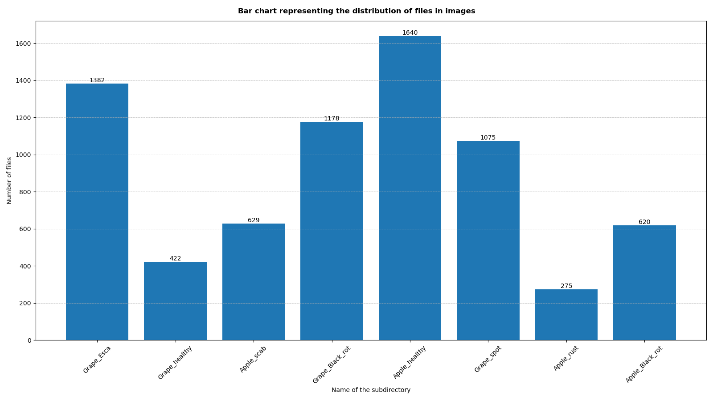
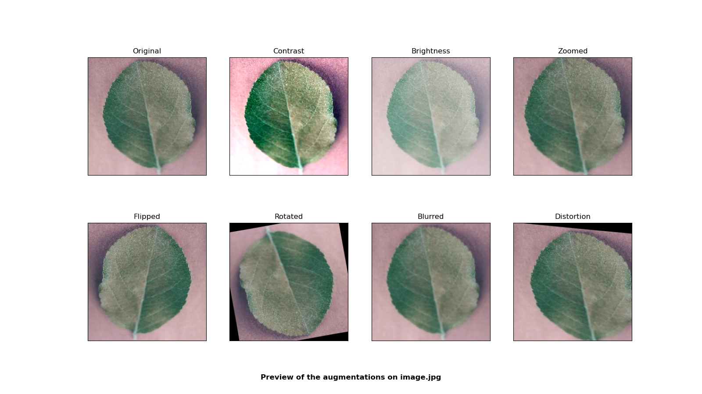
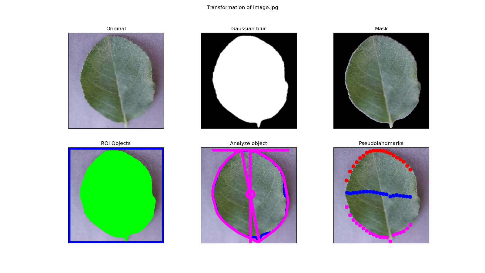
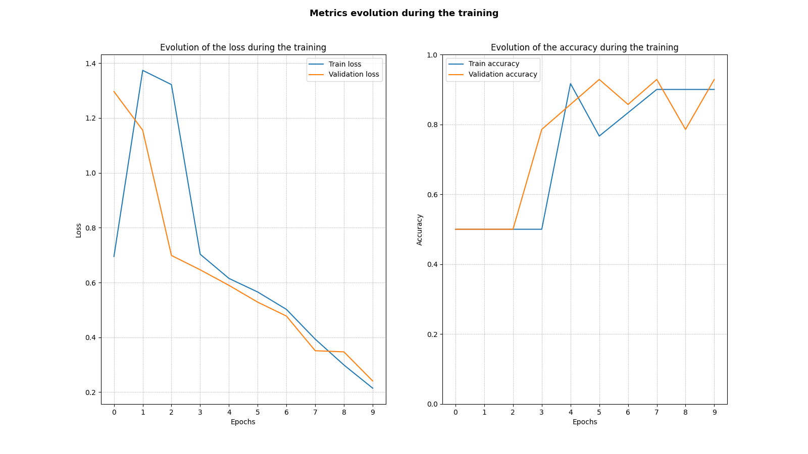

# Leaffliction

Leaffliction is a computer vision project that aims to detect plant diseases from images.

## Part I : Data analysis

Our dataset is composed of 7,221 images of healthy and diseased leaves.
</br>
The images are divided into 8 categories, each corresponding to a different plant species or a different disease.
</br>
</br>


## Part II : Data augmentation

But the dataset is not balanced, so we need to augment it to have the same number of images for each category.
We generate new images by applying small random transformations to the original images.
This reduces overfitting and improves the performance of our model.




## Part III : Image transformation

To enhance the performance of our model, we implement various transformations on augmented images.
This includes tasks such as background removal, mask creation, and outlining the borders of each leaf.
The model will undergo training using these transformed images.



## Part IV : Training and prediction

We trained a convolutional neural network (CNN) on the transformed images.
The model is then used to predict the class of new images.

```python
model = Sequential([
    Rescaling(1./255),
    Conv2D(filters=16, kernel_size=4, activation='relu'),
    MaxPooling2D(),
    Conv2D(filters=32, kernel_size=4, activation='relu'),
    MaxPooling2D(),
    Dropout(0.1),
    Conv2D(filters=64, kernel_size=4, activation='relu'),
    MaxPooling2D(),
    Dropout(0.1),
    Conv2D(filters=128, kernel_size=4, activation='relu'),
    MaxPooling2D(),
    Flatten(),
    Dense(units=128, activation='relu'),
    Dense(units=num_classes, activation='softmax')
])
```

Evolution of the loss and the accuracy for the training and the validation sets during the training phase :

